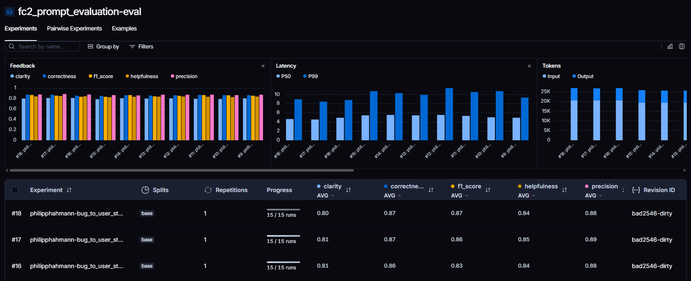

# Pull, Otimização e Avaliação de Prompts com LangChain e LangSmith

## 1. Visão Geral do Projeto

Este projeto tem como objetivo demonstrar o ciclo completo de otimização de prompts utilizando **LangChain** e a plataforma **LangSmith**. O fluxo de trabalho engloba:

- **Pull**: Importação de prompts de baixa qualidade do LangSmith Prompt Hub.
- **Otimização**: Refatoração dos prompts aplicando técnicas avançadas de Prompt Engineering para melhorar o desempenho de respostas do modelo.
- **Push**: Publicação dos prompts otimizados de volta ao LangSmith.
- **Avaliação**: Testes e medições das respostas utilizando métricas customizadas (Helpfulness, Correctness, F1-Score, Clarity, Precision), garantindo que todas as métricas atinjam pontuação mínima de 0.8 (80%).

## 2. Exemplo no CLI (Antes vs Depois)

### Antes da Otimização (Prompt v1)
Um prompt inicial não estruturado que gera métricas ruins e é reprovado nos critérios de qualidade:

```text
==================================================
Prompt: {seu_username}/bug_to_user_story_v1
==================================================

Métricas Derivadas:
  - Helpfulness: 0.45 ✗
  - Correctness: 0.52 ✗

Métricas Base:
  - F1-Score: 0.48 ✗
  - Clarity: 0.50 ✗
  - Precision: 0.46 ✗

❌ STATUS: REPROVADO
⚠️  Métricas abaixo de 0.8: helpfulness, correctness, f1_score, clarity, precision
```

### Após Otimização (Prompt v2)
Prompt refatorado utilizando técnicas de Prompt Engineering, atingindo a meta de qualidade:

```text
==================================================
Prompt: {seu_username}/bug_to_user_story_v2
==================================================

Métricas Derivadas:
  - Helpfulness: 0.94 ✓
  - Correctness: 0.96 ✓

Métricas Base:
  - F1-Score: 0.93 ✓
  - Clarity: 0.95 ✓
  - Precision: 0.92 ✓

✅ STATUS: APROVADO - Todas as métricas >= 0.8
```

## 3. Tecnologias Utilizadas

- **Linguagem**: Python 3.10+
- **Frameworks**: LangChain
- **Avaliação e Observabilidade**: LangSmith
- **Armazenamento de Prompts**: YAML
- **LLM**: OpenAI (GPT) e Google Gemini
- **Testes**: Pytest

## 4. Técnicas de Prompt Engineering Aplicadas

Para transformar o prompt reprovado em um prompt aprovado com excelência, as seguintes técnicas foram utilizadas:

1. **Role Prompting**
   - **Justificativa**: Atribuir uma persona clara ao modelo ajuda a alinhar o tom, a formatação e a maturidade técnica da resposta.
   - **Aplicação**: Iniciamos o *system_prompt* com a instrução: *"Você é um Product Manager Sênior altamente especializado em metodologias ágeis."*

2. **Chain of Thought (CoT)**
   - **Justificativa**: Em tarefas complexas como a análise de falhas, forçar o LLM a "pensar passo a passo" antes de gerar a resposta final reduz alucinações e garante que as causas-raiz não sejam ignoradas.
   - **Aplicação**: Instruímos o modelo a gerar um bloco `<thought_process>` identificando o problema, o ator e o impacto de negócio **ANTES** de escrever a User Story.

3. **Few-Shot Learning**
   - **Justificativa**: Mostrar exemplos práticos do que esperamos calibra perfeitamente o formato de saída do LLM e ensina o modelo a lidar com *edge cases* (relatos curtos ou sem contexto).
   - **Aplicação**: Inserimos no *system_prompt* cenários completos de entrada e saída. Demonstramos as formatações de saída para bugs simples e a formatação extensa com múltiplos cabeçalhos para bugs complexos.

4. **Negative Constraints**
   - **Justificativa**: Instruir o modelo especificamente sobre o que *não* fazer evita saídas prolixas e burocráticas que impactam negativamente as pontuações de Clareza nas métricas.
   - **Aplicação**: Foi inserida a regra "Não use jargões difíceis onde não for necessário e evite parágrafos longos ou redundantes", garantindo que a resposta permaneça concisa e direta mesmo contendo muitos detalhes técnicos.

## 5. Resultados Finais

- **Link do Dataset de Avaliação (LangSmith)**: 
  > [Acesse o Dataset de Avaliação e Experimentos aqui](https://smith.langchain.com/public/a02f9149-ea0e-46a5-81ab-4d29cc16fbc1/d)

- **Comparação v1 vs v2**:
  - **Prompt Original (v1)**: Era extremamente raso. O modelo tinha total liberdade geométrica, o que gerava User Stories com formatos aleatórios, critérios de aceite incompletos e nenhuma tolerância para relatos ruins.
  - **Prompt Otimizado (v2)**: Com o uso de CoT e Few-Shot, as respostas passaram a seguir fielmente a padronização Markdown esperada pela equipe (Título, Descrição e Critérios de Aceite). Além disso, o modelo ganhou senso crítico para identificar quando o relato do usuário não possui dados suficientes, adaptando a User Story de acordo.

- **Screenshots das Métricas (≥ 0.8)**:
  

- **Exemplos de Traces (LangSmith)**:
  - [Botão de adicionar ao carrinho não funciona no produto ID 1234.json](assets/traces/Botão%20de%20adicionar%20ao%20carrinho%20não%20funciona%20no%20produto%20ID%201234.json)
  - [Campo de email aceita texto sem @, permitindo cadastros inválidos.json](assets/traces/Campo%20de%20email%20aceita%20texto%20sem%20@,%20permitindo%20cadastros%20inválidos.json)
  - [No iOS, ao girar o celular para landscape, o layout da tela de perfil fica quebrado.json](assets/traces/No%20iOS,%20ao%20girar%20o%20celular%20para%20landscape,%20o%20layout%20da%20tela%20de%20perfil%20fica%20quebrado.json)

## 6. Estrutura do Projeto

```text
mba-ia-pull-evaluation-prompt/
├── .env.example              # Template das variáveis de ambiente
├── requirements.txt          # Dependências Python
├── README.md                 # Documentação do projeto
│
├── prompts/
│   ├── bug_to_user_story_v1.yml  # Prompt inicial de baixa qualidade
│   └── bug_to_user_story_v2.yml  # Prompt refatorado e otimizado
│
├── datasets/
│   └── bug_to_user_story.jsonl   # 15 exemplos de bugs para avaliação
│
├── assets/
│   ├── feedback_scores.png       # Print dos resultados
│   └── traces/                   # Exportação de traces do LangSmith
│
├── src/
│   ├── pull_prompts.py       # Faz o pull do prompt do LangSmith Hub
│   ├── push_prompts.py       # Faz o push do prompt otimizado
│   ├── evaluate.py           # Pipeline de avaliação automática
│   ├── metrics.py            # Definição das 5 métricas de qualidade
│   └── utils.py              # Funções auxiliares
│
└── tests/
    └── test_prompts.py       # Testes de validação da estrutura do prompt (Pytest)
```

## 7. Como Executar

### 7.1 Pré-requisitos
- Python 3.10+ instalado.
- Conta ativa e API Keys do [LangSmith](https://smith.langchain.com/) e OpenAI/Gemini.
- Seu próprio LangSmith Hub Handle configurado.

### 7.2 Preparação do Ambiente
```bash
# 1. Crie o ambiente virtual
python -m venv venv

# 2. Ative a venv (Windows)
.\venv\Scripts\activate
# (Para Linux/Mac use: source venv/bin/activate)

# 3. Instale as dependências
pip install -r requirements.txt

# 4. Configure as chaves de acesso
cp .env.example .env
```

### 7.3 Comandos do Pipeline
Siga a sequência abaixo para rodar o ciclo completo do projeto:

```bash
# 1. Validação estrutural do Prompt (Pytest)
pytest tests/test_prompts.py

# 2. Fazer o pull do prompt antigo (v1)
python src/pull_prompts.py

# 3. Fazer Push do Prompt Otimizado (v2) para o Hub
python src/push_prompts.py

# 4. Iniciar Avaliação (Aguarde alguns minutos para a conclusão)
python src/evaluate.py
```